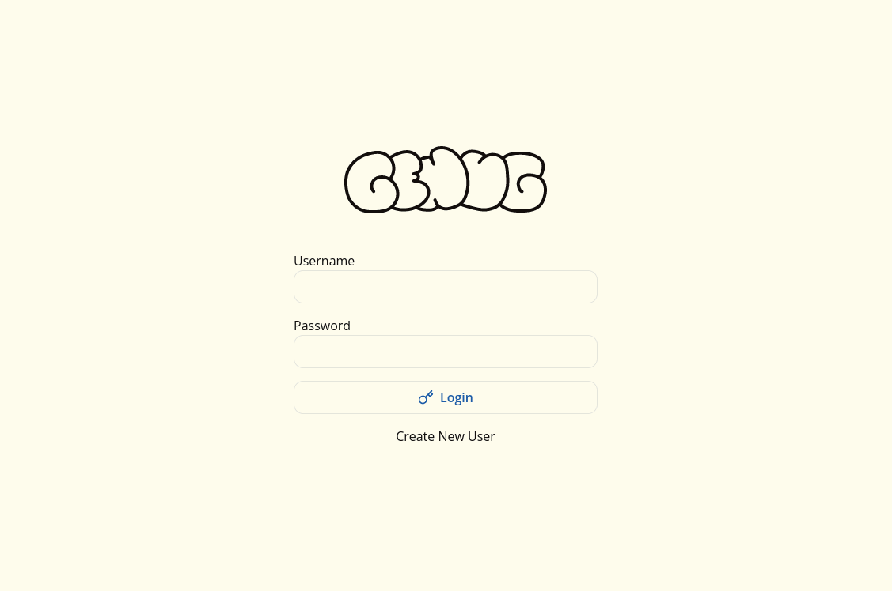

<p align="center">
  
</p>

<h1 align="center">
  genug
</h1>

<p align="center">
  <a href="https://github.com/lj-n/standalone-genug/actions/workflows/testing.yml">
    
  </a>
</p>

<p align="center">
  <b>genug</b> is a self-hosting budgeting app with focus on simplicity
</p>

<br />
<br />

<p align="center">
  
</p>

## Table of Contents

- [Table of Contents](#table-of-contents)
- [Features](#features)
  - [Categories](#categories)
  - [Transactions](#transactions)
  - [Accounts](#accounts)
  - [Budget](#budget)
  - [Teams (Coming soon)](#teams-coming-soon)
- [How it works](#how-it-works)
- [Install](#install)
- [Updating](#updating)
- [Backups](#backups)
- [Development](#development)
  - [Prequisites](#prequisites)
  - [Setup](#setup)
  - [Changing database tables](#changing-database-tables)
- [Why I did this](#why-i-did-this)

## Features

### Categories

Define categories such as food, rent, leisure, etc. to organize and track your expenses in a structured way.

### Transactions

Create, update or delete detailed transactions to get an accurate and up-to-date overview of your expenses.

### Accounts

Each transaction is linked to a specific account, so you can easily keep an eye on your account balances.

### Budget

Plan your spending every month for each category. Know what your money's doing.

### Teams (Coming soon)

This feature enables multiple users to work together on budgeting. Accounts, Categories, Transactions and Budget can be used as a team.

## How it works

- [SQLite](https://www.sqlite.org/index.html) Database with [Drizzle ORM](https://orm.drizzle.team/) for typesafety and migrations.
- [SvelteKit](https://kit.svelte.dev/) with focus on [Progressive Enhancement](https://developer.mozilla.org/en-US/docs/Glossary/Progressive_Enhancement), every feature works without JavaScript.

## Install

1. Create a local clone of this repository or download [the latest release](https://github.com/lj-n/genug/releases)
2. Run `docker build -t genug .` to build the docker image
3. Run `docker volume create genug-db` to create a docker volume, so the database can be persisted
4. Run `docker run -dp 127.0.0.1:3000:3000 --mount type=volume,src=genug-db,target=/app/data/ genug <username> <password>` to start the container (_If you provide username and password params, a user will be created. This is optional but can be useful if user-creation is disabled in your instance._)

By default [Sveltekit will accept](https://kit.svelte.dev/docs/adapter-node#environment-variables-origin-protocolheader-and-hostheader) connections on `0.0.0.0` using port 3000. You can pass the `ORIGIN` environment variable in the docker build command like this:

```sh
docker build --build-arg ORIGIN_URL=https://my-url.com  -t genug .
```

## Updating

Pull the latest changes from the repository and repeat the steps from the install section.
Database migration will be run automatically inside the docker container.

## Backups

If you want to backup your data, simply copy the `genug.db` file from the docker volume to a safe location.
If you have `sqlite3` installed on your machine, you can also use the [backup.sh](backup.sh) script to create a backup of the database. (Change the `DB_FILE` and `BACKUP_DIR` variables to your needs)

Example cronjob to run the backup script every day:

```sh

```

## Development

### Prequisites

- [Node.js](https://nodejs.org/) **(v20.x or higher)**

### Setup

1. Run `npm install`
2. Run `npm run migrations:push` to create the SQLite database
3. Run `npm run dev` to start the local dev server

### Changing database tables

The used ORM is [Drizzle ORM](https://orm.drizzle.team/).
After changes to the tables defined in `/src/lib/server/schema/tables.ts` run `npm run migrations:generate` to generate migration files.
To apply these changes to the database run `npm run migrations:push`.

## Why I did this

This app was created for personal use and learning purposes.
Everyone is free to use **genug** as they see fit.
