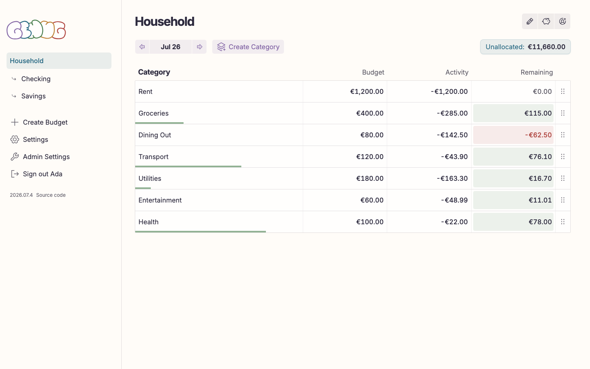
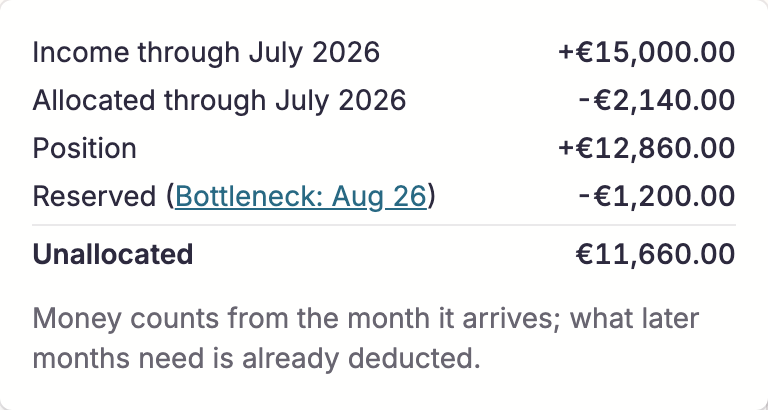
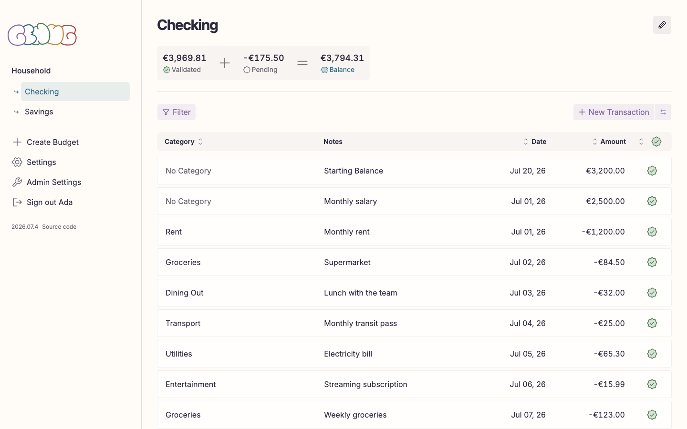

# Using genug

A feature-oriented walkthrough of the app. For installing and operating an
instance, see [self-hosting.md](self-hosting.md).

genug is an [envelope budgeting](https://en.wikipedia.org/wiki/Envelope_system)
app: money you receive lands in an unassigned pool, and you assign it to
spending categories before you spend it. Each category's remaining balance
tells you how much you can still spend in that area.

## Contents

- [First login](#first-login)
- [Budget plans](#budget-plans)
- [Accounts](#accounts)
- [Categories](#categories)
- [The monthly budget view](#the-monthly-budget-view)
  - [Assigning money](#assigning-money)
  - [Moving money and covering overspending](#moving-money-and-covering-overspending)
- [Transactions](#transactions)
  - [Transfers between accounts](#transfers-between-accounts)
- [Multi-user](#multi-user)
- [Settings](#settings)
- [Administration](#administration)

## First login

On a fresh instance, the first visit redirects to a "Create Admin" screen.
The first registered user becomes the administrator. Keep these credentials
safe — there is no email-based recovery (an operator can reset passwords from
the server shell, see [self-hosting.md](self-hosting.md#password-recovery)).

Every later visitor gets the regular login screen. Accounts are created by
the administrator (see [Multi-user](#multi-user)); there is no open
registration.

After logging in for the first time you are asked to create your first
budget plan.

## Budget plans

A budget plan is a self-contained budget with its own accounts, categories,
and transactions — for example one for personal finances and one for a side
business.

- **Create** — choose a name and a currency (EUR, USD, GBP, CAD, AUD, JPY).
- **Switch** — all your budgets are listed in the navigation; click one to
  jump to its current month. Drag to reorder them.
- **Edit** — the settings icon in the budget header opens the budget
  settings, where you can rename the budget or change its currency.

## Accounts

Accounts mirror your real-world bank accounts and credit cards. Each account
shows three balances:

- **Validated** — the sum of all validated transactions; this should match
  your bank statement.
- **Pending** — the sum of transactions you have entered but not yet
  confirmed against the bank.
- **Balance** — validated plus pending.

When creating an account you can enter a starting balance; it is recorded as
an initial validated income transaction.

An account can be **archived** once its balance is zero and all its
transactions are validated. Archived accounts keep their history and appear
on a separate archived-accounts page, from which they can be restored. An
account can only be **deleted** while no transactions reference it — history
is never silently discarded.

## Categories

Categories are the envelopes you assign money to.

- **Create** — pick a name; optional notes are free text for your own
  reference.
- **Target balance** — optionally set a target amount for a category. The
  category detail view shows how much of the target is reached. Targets are
  a planning aid; they do not block spending.
- **Archive** — a category can be archived once its remaining balance is
  zero and all its transactions are validated. Archived categories disappear
  from the budget view but keep their history and can be restored.
- **Delete** — only possible while the category has a zero remaining
  balance and no transactions reference it. This prevents past spending from
  silently turning into uncategorized income.

## The monthly budget view

The month view is the heart of the app. It lists every category with three
numbers for the selected month:

- **Budget** — the amount you assigned to the category this month.
- **Activity** — what happened in the category this month (spending or
  refunds).
- **Remaining** — what is left to spend: assignments minus spending,
  carried across months.

Use the month and year navigation to move between months; each month's
assignments are independent.

### Assigning money

Click a category's budget amount to edit it in place. Money you assign comes
out of the **Unassigned** pool shown at the top of the view.

Unassigned is month-scoped: income counts from the month it arrives, and the
pool shows what is still available to assign through the selected month. If
you have already assigned money in future months, that reservation is
reflected too — the breakdown popover shows income, allocations, and where a
future bottleneck sits. A negative Unassigned value is a warning that you
have assigned more than you have received so far, not a hard error.

### Moving money and covering overspending

Click a category's remaining value to move money without going through the
pool:

- A category with money left can **move** an amount to another category or
  back to Unassigned.
- An overspent category (negative remaining, shown in red) can **cover** the
  deficit by drawing from another category.

## Transactions

Transactions live under an account. Each has a category (or none — a
transaction without a category is income to the budget), a date, optional
notes, an amount, and a validated flag.

- **Add** — from an account, open the new-transaction form; new entries
  default to pending.
- **Edit inline** — click a row to edit category, notes, date, and amount in
  place, or delete the transaction.
- **Validate** — toggle the checkbox on a row once the transaction shows up
  on your bank statement. This moves it from the pending balance to the
  validated balance; budget math counts both.
- **Filter and sort** — filter by category (including "without category" and
  transfers) and search notes; sort by date, amount, category, or validated
  state. Filters are kept in the URL, so a filtered view can be bookmarked.

### Transfers between accounts

A transfer moves money between two accounts of the same budget without
counting as income or spending. It is stored as a linked pair — an outflow
in the source account and an inflow in the destination — with no category on
either side, so it never affects Unassigned or any category's remaining
balance. Editing or deleting a transfer always applies to both sides;
each side can be validated independently as it clears at the respective
bank.

## Multi-user

The administrator creates user accounts on the admin page: enter a username
and the app generates a one-time random password to hand to the new user.
Users change their password themselves in their settings.

Budgets can be shared. The budget owner opens the users dialog and invites
another user by their exact username. The invited user sees the invitation
on login and can accept (gaining full access to the budget) or decline.
Roles per budget:

- **Owner** — created the budget; can invite and remove users.
- **Member** — accepted an invitation; works with the budget like the owner.
- **Invitee** — invited, decision pending.

The owner can remove a user from the budget at any time; the removed user
loses access immediately.

## Settings

Personal settings cover:

- **Display name** — change your username.
- **Password** — change your password (requires the current one; signs you
  out afterwards).
- **Theme** — system, light, or dark.
- **Language** — English or German, applied immediately.

The budget's currency is a per-budget setting (see
[Budget plans](#budget-plans)), not a personal one.

## Administration

The admin page (administrator only) lists all users, offers password resets
(generating a new one-time password), user deletion, and a danger-zone
instance reset that permanently deletes all users, budgets, accounts, and
transactions.
